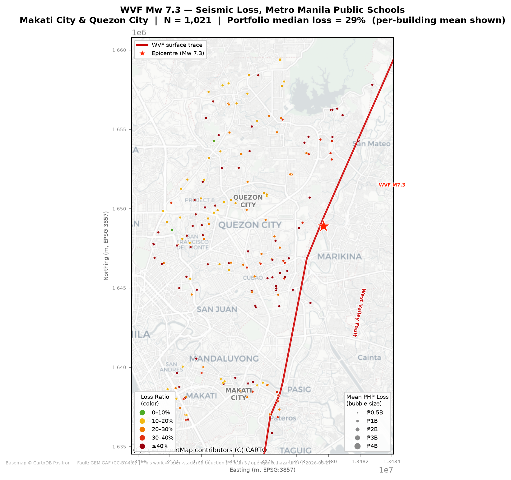
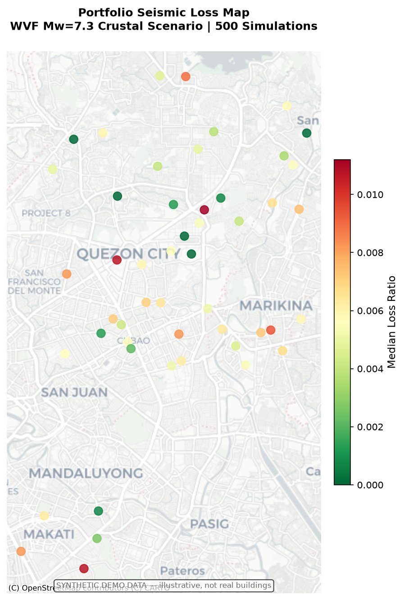

# bayanihan

Open-source Python package for seismic resilience assessment of Philippine school building portfolios.

A free, modern implementation of the methodology from the author's own open-access MASc thesis:

> Jeswani, K. K. (2021). The Seismic Resilience of Critical Spatially-Distributed Building Portfolios. MASc thesis, University of Toronto. [Open access](https://utoronto.scholaris.ca/items/4e628627-fb5b-4674-bac1-e20cb503a1f5)

Built on [Pelicun](https://github.com/NHERI-SimCenter/pelicun) (NHERI SimCenter, BSD-3-Clause). Apache-2.0 licensed.

---

**Status: v0.1 wrap-up — the full pipeline runs end-to-end on the real recovered data and reproduces the 2021 thesis's governing scenario (WVF Mw 7.3, both cities) within tolerance on the free open stack. AI-agent-built; pre-1.0; not peer-reviewed in this form.**

---

## What this is

The source work (Jeswani 2021, Jeswani et al. 2022) assessed 1,021 public school buildings across Makati and Quezon City, Metro Manila, using commercial/proprietary tools that Filipino practitioners cannot access or afford. This package ports the loss and recovery pipeline onto a free, open-source stack:

- **Hazard:** 8-branch GMPE logic tree via `openquake.hazardlib` — 4 shallow-crustal GMPEs (CY08, BA08, BSSA14, Zhao06) + 4 subduction-interface GMPEs (Youngs97, AB03, Zhao06, Abrahamson16), equal weights, per Peñarubia et al. (2020). Same ecosystem as the GEM Philippine national model (PEM). Spatial correlation: Loth-Baker (2013).
- **Damage + loss:** [Pelicun](https://github.com/NHERI-SimCenter/pelicun) (FEMA P-58 component-based methodology), custom `PH.*` component library (20 archetypes).
- **Recovery:** Philippine-calibrated REDi methodology (Almufti & Willford 2013) implemented natively via Pelicun's per-repair-class machinery + Philippine impeding-factor delays. No external PyREDi dependency.
- **Portfolio:** Monte Carlo with spatially-correlated IM fields across building inventories.

The goal is for a Filipino structural engineer to `pip install bayanihan` and run a school portfolio assessment against a scenario earthquake without needing a commercial license for anything.

## Current state

The full chain runs end-to-end on the **real recovered data**: `hazard.py` (openquake.hazardlib 8-branch GMPE tree + Loth–Baker spatial correlation) → spatially-correlated Sa(T₁) field → real multi-stripe PERFORM-3D EDPs → Pelicun damage + loss + FEMA P-58 casualties → native REDi recovery milestones → 1,021-building portfolio Monte Carlo → loss map.

**576 tests** pass on Python 3.13 (542 fast + 34 heavy integration runs — see [Development](#development)).

**Validated** against the 2021 thesis's governing scenario (WVF Mw 7.3, Makati + Quezon City, N = 1,000): whole-portfolio loss, injuries, and fatalities all reproduce within ~±15% on the open stack — see [Validation](#validation-wvf-mw-73) below.

**Caveats (honest):** the real 1,021-building inventory is **not redistributed** (it needs city consent), so the bundled inventory is synthetic for the demo/CI path. Some residuals (per-region fatalities, recovery time) run high — documented, not tuned. Pre-1.0.

## Validation (WVF Mw 7.3)

The governing thesis scenario, reproduced on the open stack for all 1,021 schools (96 Makati + 925 Quezon City), N = 1,000 correlated realizations, untuned:

| Decision variable (median) | This work | 2021 Thesis | Δ |
|---|---:|---:|---:|
| Whole-portfolio loss ratio | 0.295 | 0.256 | +15% |
| Whole-portfolio injuries | 59,373 | 58,117 | +2% |
| Whole-portfolio fatalities | 3,057 | 2,899 | +5% |
| Quezon City loss ratio | 0.323 | 0.31 | +4% |
| Makati loss ratio (mean) | 0.267 | ~0.26 | +3% |



Full KPIs for both cities (all decision variables + figures + honest residuals): **[docs/outputs/](docs/outputs/README.md)**. DV-by-DV detail and per-archetype reconciliation: **[docs/validation/eval_scorecard.md](docs/validation/eval_scorecard.md)**.

## Demo (no real data needed)

The package ships a 50-school **synthetic** demo inventory so anyone can run a portfolio assessment without the (gitignored) real data:



*Loss map for 50 synthetic Manila schools, WVF Mw 7.3 crustal scenario. Synthetic demo data — illustrative, not real buildings.*

## Why this exists

This package is a deliberate rebuild of work I spent years on — using an AI agent harness to give a free, modern, reproducible life to a methodology that was sound but, the first time around, never got used. It's a builder reclaiming a piece of his own past with tools he didn't have back then.

The full story is in **[SOUL.md](SOUL.md)**.

The thesis source material — all 8 chapters and appendices — is in [`docs/thesis/`](docs/thesis/) as structured markdown, readable alongside the code.

## How it was built

This repo was built predominantly by AI agents (Claude Code). The agent definitions are in [`agents/`](agents/) ([overview](agents/README.md)) — executable briefs, one per phase, that a fresh agent can run from scratch. The harness design is in [`docs/agentic-harness-principles.md`](docs/agentic-harness-principles.md); the full project instructions are in [`.claude/CLAUDE.md`](.claude/CLAUDE.md). That's part of the artifact. (Internal orchestration state and working notes are kept in gitignored local directories, following the `.local/` convention.)

## Going deeper

**Thesis chapters:** [`docs/thesis/`](docs/thesis/) — 8 chapters + 4 appendices covering hazard, building stock, fragility development, and portfolio assessment. The package maps directly to these chapters.

**Reference material** captured during the build:
- [`docs/reference/hazard_notes.md`](docs/reference/hazard_notes.md) — GMPE selection rationale and spatial correlation implementation
- [`docs/reference/redi_methodology.md`](docs/reference/redi_methodology.md) — REDi resilience methodology (Almufti & Willford 2013), used as the recovery model basis
- [`docs/reference/pelicun_recovery_notes.md`](docs/reference/pelicun_recovery_notes.md) — what Pelicun provides natively vs what lives in the custom recovery layer
- [`docs/reference/pelicun_csv_schema.md`](docs/reference/pelicun_csv_schema.md) — schema for the custom `PH.*` component library

**The harness:** [`agents/`](agents/) — six agent definitions, one per build phase; [`docs/agentic-harness-principles.md`](docs/agentic-harness-principles.md) — the orchestration principles behind them.

## Install

```bash
# Install from source (PyPI release deferred until validated)
git clone https://github.com/kevinjeswani/bayanihan
cd bayanihan
pip install -e .
```

Requires Python 3.13+. Key dependencies: `pelicun>=3.9,<4`, `openquake-engine>=3.25`.

## Quick start

### Single-building assessment

```python
from bayanihan import Building
import numpy as np

# Instantiate from one of the 20 thesis archetypes
b = Building.from_archetype("C1-M (Hi)")

# Provide EDP samples: shape (n_sims, n_stories, 2) where [..., 0]=PID, [..., 1]=PFA(g)
# (Synthetic placeholder; real PERFORM-3D EDPs replace this in P2.)
# PLACEHOLDER(P2): mean=-3.5 gives median PID ~3% — moderate shaking scenario.
n_sims, n_stories = 500, b.stories
rng = np.random.default_rng(42)
pid = rng.lognormal(mean=-3.5, sigma=0.5, size=(n_sims, n_stories))  # ~3% median drift
pfa = rng.lognormal(mean=-0.7, sigma=0.4, size=(n_sims, n_stories))  # floor accel (g)
edp_samples = np.stack([pid, pfa], axis=-1)                          # (n_sims, n_stories, 2)

result = b.assess(edp_samples, seed=42)
print(f"Mean loss ratio:         {np.mean(result['loss_ratio']):.3f}")   # ~0.07 at ~3% drift
print(f"Median reoccupancy:      {np.median(result['reoccupancy_days']):.0f} days")
```

### Portfolio demo (end-to-end)

```python
from bayanihan import PortfolioAnalysis
import numpy as np

# Loads the 50-building synthetic demo inventory
pa = PortfolioAnalysis.from_demo_inventory(n_simulations=500, seed=2026)

# Run WVF Mw=7.3 crustal scenario
result = pa.run({
    "Mw": 7.3,
    "lat": 14.35,
    "lon": 121.10,
    "depth": 20.0,
    "mechanism": "crustal",
})

plr = result["portfolio_loss_ratio"]
print(f"Median portfolio loss ratio: {np.median(plr)*100:.2f}%")
```

Or run the full demo script:

```bash
python prototypes/2026-06-26_portfolio_demo.py
```

This produces `images/demo_portfolio_loss_map.png` and `images/demo_portfolio_loss_distribution.png`.

### Explore archetypes

```python
from bayanihan import get_archetype, list_archetypes, ARCHETYPE_IDS

# 20 archetypes: 15 with independent fragilities + 5 merged aliases
print(ARCHETYPE_IDS)

# Get a configured Building instance for any archetype
b = get_archetype("C1-L (Pre/Lo)")
```

## Sources & provenance

This package is an independent reimplementation of the author's own work. The primary source is the **open-access, sole-authored MASc thesis** — its appendices document the full methodology (fragility functions, consequence models, recovery logic) in the detail needed to reproduce it. Every fragility, consequence, and recovery parameter here traces to a table in that thesis.

**Thesis — primary source (open access):**
```
Jeswani, K. K. (2021). The Seismic Resilience of Critical Spatially-Distributed
Building Portfolios. MASc thesis, University of Toronto.
https://utoronto.scholaris.ca/items/4e628627-fb5b-4674-bac1-e20cb503a1f5
```

The work was subsequently published in peer-reviewed form — Jeswani et al. (2022), *Earthquake Spectra* 38(3), 1946–1971, [doi:10.1177/87552930221086304](https://doi.org/10.1177/87552930221086304) — and presented at 17WCEE (2020); see those for the published results.

No proprietary code or data is reproduced here. The package is built only from the open-access thesis, open-source tools ([Pelicun](https://github.com/NHERI-SimCenter/pelicun), `openquake.hazardlib`), and the author's own analytical outputs.

## Citation

If you use this package, please cite the work it reimplements — the open-access, sole-authored MASc thesis — not this repository:

```
Jeswani, K. K. (2021). The Seismic Resilience of Critical Spatially-Distributed
Building Portfolios. MASc thesis, University of Toronto.
https://utoronto.scholaris.ca/items/4e628627-fb5b-4674-bac1-e20cb503a1f5
```

A machine-readable [CITATION.cff](CITATION.cff) is included in the repo root.

## Disclaimer

> **This is an experimental, AI-agent-built package.** The implementation was built predominantly by AI agents (Claude Code) under the author's direction. Results are not peer-reviewed in this form. The open-stack reproduction matches the original thesis decision variables within tolerance (see [Validation](#validation-wvf-mw-73)), but it is a reimplementation, not the original analysis. See [DISCLAIMER.md](DISCLAIMER.md) for the full disclaimer.

Parameter provenance is documented throughout. **The bundled inventory is synthetic** — approximately 50 hypothetical school buildings for demonstration and CI. The real 1,021-building dataset is not redistributed (it needs the consent of the Quezon City and Makati school authorities). Some residuals (per-region fatalities, recovery time) are documented and not tuned away.

## Development

### Tests vs. simulations

The test suite checks that **the model runs correctly** — it is fast (~1 min) and is meant to run on every change. It does **not** run production Monte-Carlo simulations.

```bash
pytest                   # fast suite: unit tests + one small end-to-end smoke per model path
pytest -m integration    # heavy real-data portfolio runs (1,021 buildings) — run on major lifts only
pytest -m ""             # everything (fast + integration)
```

The full **N=1000 production runs** that regenerate the committed results
(`bayanihan/data/results/*.json`) live in [`scripts/`](scripts/), **not** the test suite —
they are minutes-scale per scenario and are run on demand:

```bash
.venv/bin/python scripts/run_wvf73_portfolio.py     # governing WVF Mw 7.3 event (Makati + QC)
.venv/bin/python scripts/run_wvf73_mitigated.py     # base vs mitigated
.venv/bin/python scripts/run_scenario_breadth.py    # the other four thesis scenarios
```

Production runs need the gitignored real inventory; without it the runners exit early and the fast test suite still passes. See [`scripts/README.md`](scripts/README.md).

## License

Apache-2.0. See [LICENSE](LICENSE).
