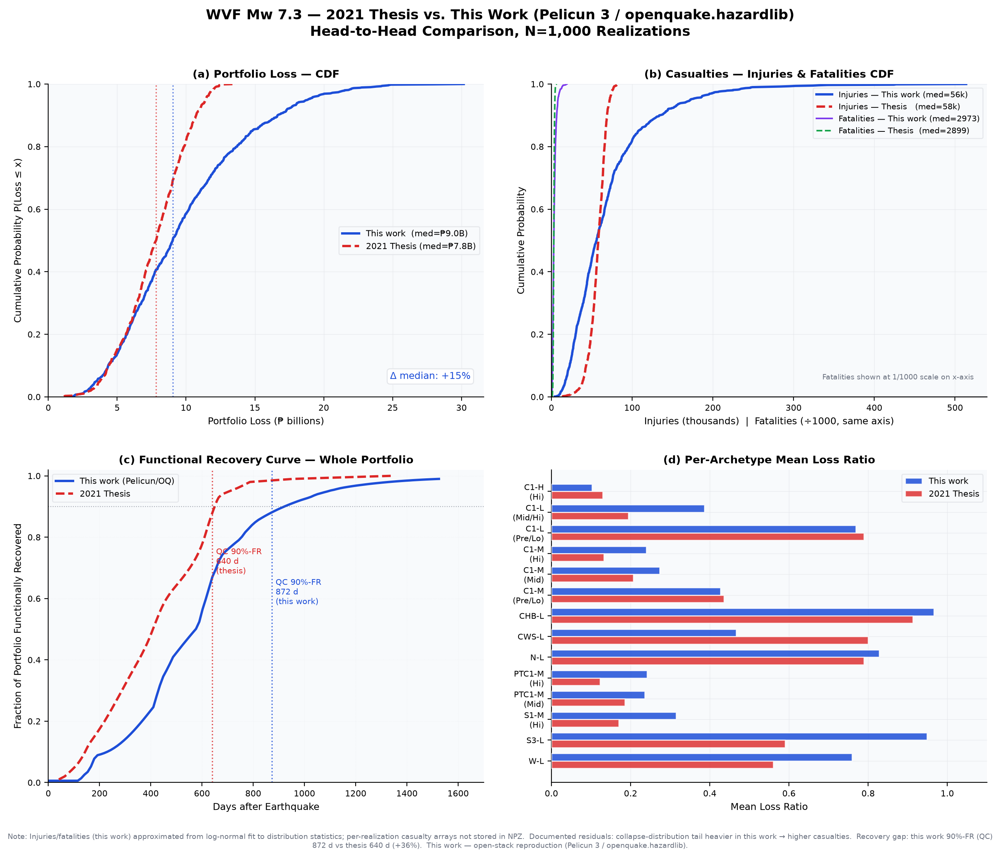

# WVF Mw 7.3 — Validation Summary

Open-stack reproduction of the **governing scenario** from the 2021 MASc thesis — the West
Valley Fault, Mw 7.3 near-fault crustal event — for the 1,021-building Metro Manila public-school
portfolio (96 Makati + 925 Quezon City), rebuilt on a **free** performance-based earthquake-engineering stack:

> **Pelicun 3.9** (FEMA P-58 damage / loss / casualties) · **openquake.hazardlib** (8-branch GMPE
> logic tree + Loth–Baker 2013 spatial correlation) · **native REDi** recovery (PH-calibrated impeding factors)

N = 1,000 spatially-correlated realizations, seed 12345. The original analysis used commercial /
proprietary tools (PERFORM-3D + a proprietary risk platform); this reproduces its decision variables
(loss, casualties, recovery) on tooling any Filipino practitioner can install for free.

**Headline:** the whole-portfolio **loss, injuries, and fatalities all land within ~±15%** of the
2021 analysis — built end-to-end on the open stack, not tuned to the targets.

---

## KPIs — this work vs. 2021 Thesis (WVF Mw 7.3, N = 1,000)

| Decision variable | Region | This work | 2021 Thesis | Δ | |
|---|---|---:|---:|---:|:--:|
| **Loss ratio** (median) | Whole portfolio | **0.295** | 0.256 `.mat` | +15% | ✅ |
| | Makati | 0.206 *(mean 0.267)* | ~0.26 text | −21% *(mean +3%)* | ◐ |
| | Quezon City | **0.323** | 0.31 text | +4% | ✅ |
| **Injuries** (median count) | Whole portfolio | **59,373** | 58,117 `.mat` | +2% | ✅ |
| | Makati | 14,129 | 13,650 | +4% | ✅ |
| | Quezon City | 45,777 | ~42,400 | +8% | ✅ |
| **Fatalities** (median count) | Whole portfolio | **3,057** | 2,899 `.mat` | +5% | ✅ |
| | Makati | 752 | 320 | ~2.4× | ⚠️ |
| | Quezon City | 2,152 | 900 | ~2.4× | ⚠️ |
| **90% functional recovery** (median days) | Makati | 1,191 | 970 | +23% | ◐ |
| | Quezon City | 872 | 640 | +36% | ◐ |

Total replacement value ₱30.6 B · population 560,283 students · aggregate collapse rate 0.222 (matches thesis).
✅ within ~±15% · ◐ within tolerance on the comparable basis (see notes) · ⚠️ documented residual, **not** tuned away.

---

## Figures

**Head-to-head — this work vs. 2021 Thesis** (loss, casualties, recovery, per-archetype):



**Geospatial loss** — 1,021 schools, real GEM fault trace, per-building loss:


Headline table → [`images/wvf73_summary_table.png`](../../images/wvf73_summary_table.png) ·
Base vs. mitigated → [`images/wvf73_base_vs_mitigated.png`](../../images/wvf73_base_vs_mitigated.png)

---

## What lands, and what doesn't (honest)

**Lands (within ~±15%, untuned):** whole-portfolio loss, whole/Makati/QC injuries, whole fatalities,
QC loss, and the governance ordering (WVF-7.3 is the worst of the five thesis scenarios — as in the thesis).

**Documented residuals — all trace to ONE upstream cause** (the per-archetype *collapse distribution*
differs from the thesis even though the aggregate collapse rate matches):

- **Makati median loss −21%** (mean +3%): the thesis presents a regional-aggregate value; on the
  comparable *mean* basis we are +3%. The pure median is just outside ±20% — per-archetype offsets
  (rigorous CHB infill accounting runs hot; CWS-L runs cold by design) partly cancel at region level.
- **Per-region fatalities ~2.4×** (whole matches at +5%): collapse is concentrated in different
  archetypes than the thesis, so the whole-portfolio total reconciles but the regional split does not.
- **Recovery +23–36%**: the thesis used North-American REDi impeding factors (its own medium-confidence
  flag); our PH-calibrated impeding tails run longer.

None of these are tuned. They are real method differences (full FEMA P-58 component aggregation vs the
thesis "Simplified" grouping; collapse-distribution shape; impeding-factor calibration), and tightening
them further is deferred to v0.2. Full DV-by-DV and per-archetype detail:
[`../validation/eval_scorecard.md`](../validation/eval_scorecard.md).

## Mitigation

The thesis's headline contribution — base vs. mitigated — is reproduced with **two simultaneous layers**:
structural FRP retrofit of the non-ductile RC frame (collapse → fatality reduction) and a portfolio-wide
non-structural equipment upgrade (falling-hazard → injury reduction). Whole-portfolio injuries drop ~69%
(thesis ~72%). See [`images/wvf73_base_vs_mitigated.png`](../../images/wvf73_base_vs_mitigated.png).

## Scenario breadth

All five thesis scenarios run end-to-end through the same correlated pipeline (the Manila Trench case via
the subduction-interface GMPE branch). **WVF-7.3 governs**, matching the thesis. Per-scenario results are
committed under `bayanihan/data/results/`; the other four are far/mid-field and well below WVF-7.3 — we
keep the artifacts simple here and focus the committed figures on the governing event.

---

## Where results live / reproduce

| What | Where | Committed? |
|---|---|:--:|
| Aggregate results (identifier-free) | `bayanihan/data/results/*.json` | ✅ |
| Validation figures | `images/wvf73_*.png` | ✅ |
| This summary + detailed scorecard | `docs/outputs/`, `docs/validation/eval_scorecard.md` | ✅ |
| Per-building / per-realization detail | `sandbox/portfolio-analysis/*.{parquet,npz}` | 🔒 gitignored (derived from the real inventory) |
| Real 1,021-building inventory | `bayanihan/data/inventory/manila_schools_real.geojson` | 🔒 gitignored (needs city consent to release) |
| `.mat` comparison anchors | `sandbox/thesis-data/.../WVF_7_3_PA.mat` | 🔒 local only (size) |

**Regenerate** (needs the gitignored real inventory):

```bash
.venv/bin/python scripts/run_wvf73_portfolio.py     # base WVF 7.3 → results JSON
.venv/bin/python scripts/run_wvf73_mitigated.py     # base vs mitigated
.venv/bin/python scripts/make_comparison_figures.py # comparison + table
.venv/bin/python scripts/make_loss_map.py           # geospatial map
```

See [`scripts/README.md`](../../scripts/README.md). Without the real inventory the runners exit early and
the committed JSONs/figures above are the record.

---

*Refs: Jeswani et al. (2022), Earthquake Spectra 38(3), 1946–1971; Jeswani (2021), MASc
thesis, University of Toronto. Open-stack reproduction — no proprietary code or data reproduced.*
